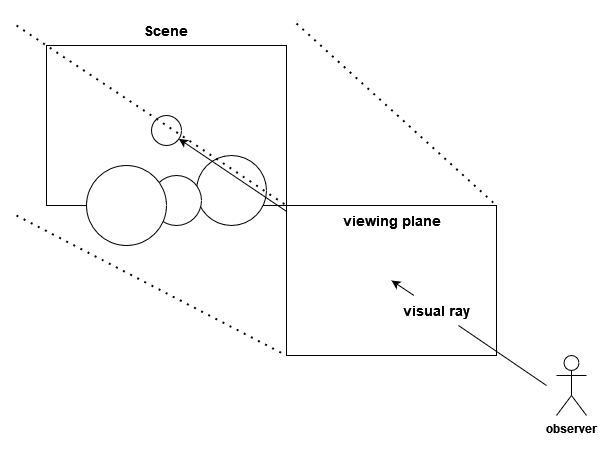
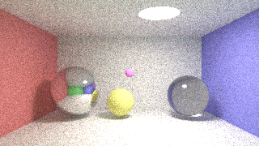

# Lightweight (CPU) ray tracer from scratch
> A scene renderer capable of rendering simple 3D scenes using a ray tracing approach with minimal libraries. By Tizian Rettig

## Requirements
The application was written with C++ 20 in mind and was only tested as such. However, it might be possible to run it
using other versions with minimal changes to the code. The project uses [cmake](https://cmake.org/) to build the executables.

## Getting started
Either import the project folder into an IDE of your choice. If said IDE has cmake integration, it should automatically being
picked up and be buildable.

Or build it by hand with the following command (inside the projects root directory):
* Prepare the build process with: `cmake -S <your project dir> -B <your desired output dir>` this will generate a bunch of cmake related files and a`make file` or a `.sln file`.
* Build the resulting file(s):
  * Using `make` -> change into the directory defined for argument `-B` in the previous step and run `make`.
  * Using `MSBuild` -> locate your `MSBuild.exe` (note this is only available when visual studio is installed). Mine was located at the path: `C:\Program Files (x86)\Microsoft Visual Studio\2019\Community\MSBuild\Current\Bin\MSBuild.exe`. Then run `MSBuild.exe C:\path\to\RayTracer.sln`
* Run `./RayTracer`
  * No command line arguments are needed as the project is currently configured using macros in the `main.cpp` and `RayTracerUtility.cpp` files.

## General concept
The raytracer is written based on the idea of calculating each pixel color of an image buffer by casting a ray from an **observer**
through the **viewing plane** into the 3D scene. If a ray intersects an object, the pixel the ray originated from will get colored
according to the object color and lighting at that intersection point. Resulting in a pseudo shadow that is projected onto the viewing plane.
This approach is visualized in the following image:

### Example output:

### Further information
A more detailed explanation of several aspects of the raytrace can be found in the list below:
 - [Pseudo code](./doc/PseudoCode.md)
 - [The camera of a ray tracer](./doc/Camera.md)
 - [How to cast a ray into a 3D scene](./doc/HowToCastARay.md)
 - [Calculating a single pixel](./doc/PixelCalculation.md)
   - [Diffuse reflection](./doc/DiffuseReflection.md)
   - [Specular reflection](./doc/SpecularReflection.md)
   - [Refraction](./doc/Refraction.md) 

## Special thanks & History
This application was originally implemented as an exercise of the M.Sc. Computer Science course "Computer Graphik" held
by **Prof. Dr. Elke Hergenröther** at the Hochschule Darmstadt (H_Da) in the winter semester of 2020/2021. The initial version
was written together with another student: **Yannik Schäfer**.  Afterwards, the
project was expanded on to be more physically accurate. This was achieved by implementing concepts of the project 
["smallpt: Global Illumination in 99 lines of C++"](https://www.kevinbeason.com/smallpt/) by **Kevin Beason** that was worked on
over the course of seven years starting from 4/29/2007.

As the project is highly condensed to fit into 99 lines of C++ code, it is hard to follow its intricacies. Therefore,
the original code was analyzed and adjusted by **Dr. David Cline** of Oklahoma State University to be presented in one of his
lectures. His presentation was kindly provided by him in the references of the project by **Kevin Beason** and are available
to view [here](https://docs.google.com/open?id=0B8g97JkuSSBwUENiWTJXeGtTOHFmSm51UC01YWtCZw). These slides helped greatly in the
implementation of this ray tracer.

## Libraries & Licenses
The only library in this project is the: "[Platform Independent - Bitmap Image Reader Writer Library](http://partow.net/programming/bitmap/index.html)"
written by **Arash Partow** in 2002. It is distributed under the MIT license. (See also: [source code comment](./lib/bitmap_image.hpp))
