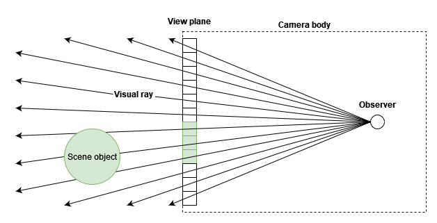
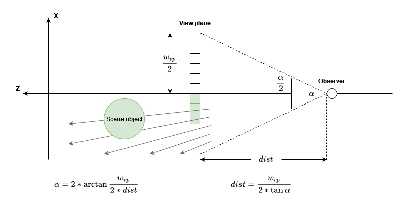

# The Camera of a ray tracer
A ray tracer uses visual rays to project scene objects onto a plane. This approach differs from a typical 3D camera
used by rasterizer (or what you could consider "normal" rendering). Due to this, the inner workings of the "camera"
differ as well. The following 2D view demonstrates how a ray tracing camera would translate a 2D scene onto a 1D
image buffer:



As shown in the image above, the ray tracer camera works by casting visual rays through the view plane one pixel at the
time. Each ray is then followed to see if it intersects with an object of the scene. If so, the pixel is colored accordingly.

## Field of View & Observer distance
> See: [Field of View](https://en.wikipedia.org/wiki/Field_of_view) and [Angle of View](https://en.wikipedia.org/wiki/Angle_of_view)

To correctly distance the observer from the viewing plane, one must either calculate the resulting field of view and
choose the observer distance accordingly, or choose a desired field of view and calculate the resulting observer distance.
The following diagram describes how this can be done using trigonometry:



## Moving to 3D
All illustrations depicted a camera in 2D space projecting onto a 1D view plane. Both diagrams can be expanded to conform
to 3D space. As all calculations stay equivalent, but a third component is added to each vector, an illustration is omitted.

A noteworthy point to make however, is that the view plane in a sense is a direct mathematical model of the image buffer
that is used to safe the output image. Therefore, it is important that the view plane has the same aspect ratio as the image
buffer used. If this is not the case, the output image will be distorted corresponding to the difference in aspect ratios.

### Implementation
The actual implementation of the camera in this ray tracer is done using two structs.
```
struct ViewPlane {
    float width;
    float height;
    Vec position;
};

struct Observer {
    Vec position;
};
```

