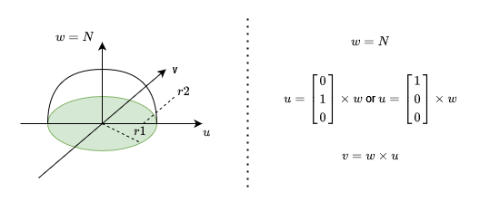
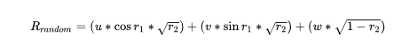

# Diffuse reflection
Physically diffuse reflections are reflections that scatter the incoming light into a multitude of random directions
(See: https://en.wikipedia.org/wiki/Diffuse_reflection). However, calculating all of that would require a huge amount of 
computational resources. It would also result in an exponential growth for the computational complexity as soon as a ray
reflects of more than one diffusive surface one after the other. To avoid the exponential growth we only follow a single
random ray instead. Approximating the "rest" of the rays will then be dealt with by casting a fix number of rays from the
same starting position (Samples per pixel).

## Calculating a random ray

Assuming we know the intersection point _P_surface_ as well as the surfaces normal _N_. We can generate a random ray
by using a random angle _r1_ and a random distance _r2_ (normalized to be between 0.0 and 1.0). As shown below,
we first create an orthonormal coordinate frame _(w, u, v)_ based on the normal _N_.

Note that _u_ is generated by the cross product of _w_ with either the X or the Y-axis of the default coordinate frame.
The decision which is used is made based on the x component of _w_. If the x component indicates that _w_ is parallel to
the Y-Z-plane (|x| < 0.1), the X-Axis is used for the cross product. Otherwise, the Y-Axis is used.

With _w_, _u_, and _v_ in place we can now turn our random angle _r1_ and our random distance _r2_ into a random vector
using this formula:

