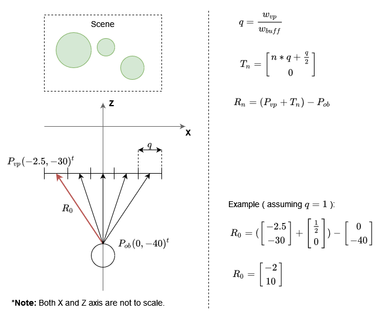
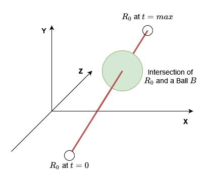

# How to cast a ray into a 3D scene
Assuming the concept of the camera used in this ray tracer is understood. Resulting from the view plane defined by the
camera, and the chosen resolution our buffer for the final image has, we can calculate a two-dimensional array of vectors.
The following diagram below illustrates the calculations necessary assuming a 2D scene. Applying the calculations in a
3D scene should only require minimal changes to the basic vector math at play and is therefore not elaborated on.

With _w_vp_ being the width of the view plane and _w_buff_ being the buffer width, we can calculate the direction each
ray will take. Taking _R_0_ as an example then, we can then build a line using the vector equation. This line combined with
a start- and endpoint will represent our ray. Assuming _R_0_ to be defined like shown below, we can calculate our first ray
as such:

_L_0_ = (_P_vp_ + _T_0_) + _t_ * _R_0_

## Intersections
Now that we have a line equation, _t_ is our way to define a starting point of our ray at _t_ = 0 and an endpoint.
Defining an endpoint is not strictly necessary. It only serves as an implementation detail for checking if a ray has
ever hit anything or if it "left the scene" without an intersection. If so a background color or a default color will
be written into the image buffer.

All that needs to be done now, is to calculate all intersections of each ray with the scene objects (Note: if multiple
intersections occur, the intersection with the smallest value for _t_ is selected). This will be the easiest for spheres
as they are the simplest three-dimensional object imaginable (mathematically speaking). All we need to represent a sphere
is a radius _r_ and a position _p(x, y, z)_.