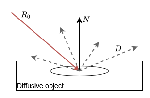
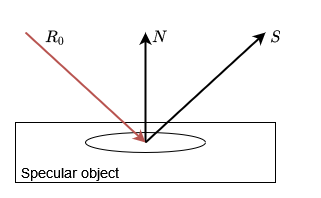
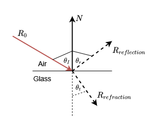
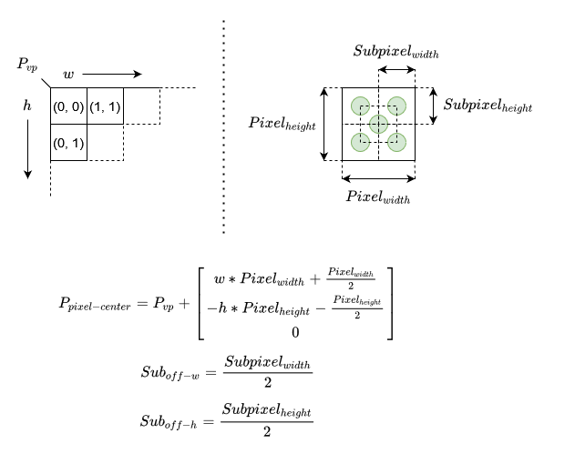

# Calculations done per pixel
On a top level view each pixel calculated with the ray tracer can be looked at separately. This means we can take a
closer look at the calculations that go into a single pixel and will be able to extrapolate it to the complete image.

## Recursion
To realistically light the scene, this ray tracer will (recursively) follow a chain of rays for each pixel. Each segment
of this chain is calculates its first intersection with any 3D object in the scene. If one such intersection is found, 
the ray accumulates some object color and is cast into a new direction. Each change in direction generates a new ray
based on the surface hit. There are three types of surfaces implemented:

### [Diffuse reflection](DiffuseReflection.md)

As soon as a ray intersects an object with a diffusive surface, a new randomly oriented ray _D_ is generated.

### [Specular reflection](SpecularReflection.md)

As soon as a ray intersects an object with a specular surface, a new mirrored ray _S_ is generated.

### [Refraction](Refraction.md)

As soon as a ray intersects an object with a refractive surface, one or two rays are generated. In this case only a
percentage of light is send into the refractive object and another portion is reflected.

### End of the recursion
The recursion will end under two circumstances:
 - The maximum recursion depth is reached
 - The ray did not intersect with any object

Both cases return the color black as it is represented by the RGB values (0, 0, 0).

## Samples per pixel
Due to diffusive and refractive objects in the scene the path a given ray takes is purposely non-deterministic. As we trace
a single path throughout the scene, we get the information of each point that we hit and color our pixel accordingly.
This is however not enough to represent a realistic scene. One pixel of our image should not only be influenced by a single path
our ray could take. It should be an accumulation of "all" path the ray could have taken. As this is not computable in a
human lifetime, we need to approximate it. This is done by tracing a small number of rays per pixel and accumulating them.
This will approach a better and better approximation of the real value we would have expected.

Note: This introduces noise to our image that will be reduced the more rays we case per pixel. 

## Anti-Aliasing
Even with multiple samples per pixel, we will not get a realistic result. This is due to the rasterization of our image.
Since we use a pixel raster to represent our image, we have issues when we want to display edges that do not line up with
a pixel border. This is most note able on the first intersection of a ray as this intersection has the biggest impact on
the final color of the image. To handle this issue we build a poor-man's antialiasing algorithm that divides each pixel
into 5 extra sub-pixels. Each sub-pixel is offset from the originals center resulting in a smoothing effect around edges.

The illustration above shows how this is calculated. Using the view plains origin point _P_vp_ and the current index value
for the X and Y-Axis (_w_ and _h_) we can calculate both the pixel center we are interested in, and the sub-pixel positions.
The concrete sub-pixel positions are calculated from the pixel center using the _Sub_off-w_ and _Sub_off-h_ values.
