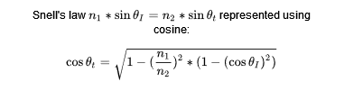
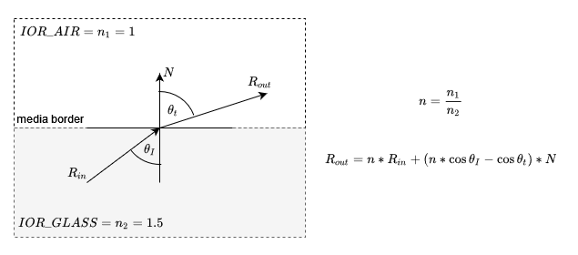
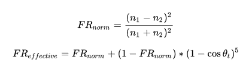

# Refraction
The most complicated case of intersection is the refraction (combined with the reflection) at the border surface of
two optical media with different indices of refraction (See: https://en.wikipedia.org/wiki/Refractive_index). To summarize
what an index of refraction (IOR) is: It is a factor that is used to describe the "bending" of light when it goes through
the border between two optical media (For example, a transition from air to water).

[List of the IOR for different media](https://pixelandpoly.com/ior.html)

Furthermore, in contrast to all reflections so far, we now generate two rays. One ray that represents the portion 
of the light reflected at the surface. And a second ray that represent the portion of light that makes it through the
border. The first ray is simple to calculate, it is mirrored using [specular reflection](SpecularReflection.md) and
weighted accordingly. The other one is a little more tricky and uses [Snell's law](https://en.wikipedia.org/wiki/Snell%27s_law)
to compute the refraction angle (_theta_r_) based on the angle of incidence (_theta_I_).

## Calculating a refracted ray

Assuming we are given the incoming ray _R_0_ and with an angle of incidence _theta_I_ to the surface normal _N_. We can
use the equation:

To compute the refracted ray _R_refraction_. However, the refracted ray does not always exist. If
the _critical angle_ is reached, the equation will break for non-complex values as the term under the square root becomes
negative. This becomes useful to us. Checking if the term under the root is negative can be used to decide whether the
refraction ray needs to be cast by our ray tracer.

Assuming the refracted ray exists ( cos²(theta_t) > 0 ) we can calculate the refracted ray using:

However, due to implementation reasons, this formula is slightly adjusted in the code. The reason for this is to avoid
flipping the normal vector which is necessary depending on the direction _R_out_ approaches the media border.

## Ray intensity
Now that we know how the direction of our two outgoing rays is calculated, we still do not how "much" light is refracted
or reflected. Ideally we would have a percentage value to weigh our rays after calculating them. For this we will use the
[Fresnel equations](https://en.wikipedia.org/wiki/Fresnel_equations) or to be more exact the
[Schlick's approximation](https://en.wikipedia.org/wiki/Schlick%27s_approximation) for said equations.

To calculate the weights of each ray, the fresnel reflectance is approximated using the formula shown above. Afterwards,
the reflected ray is weighted by the reflectance _FR_effective_ and the refracted ray is weighted by its inverse
(_1 - FR_effective_).