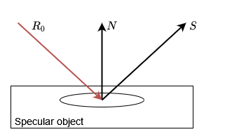

# Specular Reflection
The reflection of mirrored surfaces aka specular reflection (See: https://en.wikipedia.org/wiki/Specular_reflection) is
one of the simpler aspects of raytracing. Calculating a corresponding ray for a given incoming ray boils down to mirroring
the directional vector of the incoming ray on the surface normal.

## Calculating a mirrored ray

Given an incoming ray _R_0_ with an angle _theta_i_ to the surface normal _N_, the new ray will have a corresponding
angle _theta_o_ with _theta_i_ = _theta_o_. To find such a ray, we can use the [Householder matrix](https://en.wikipedia.org/wiki/Householder_transformation)
like this:

(Image taken directly from https://en.wikipedia.org/wiki/Specular_reflection)

Where _d_s_ is our outgoing vector _S_, _d_i_ is our incoming vector _R_0_ and _R_ is the mentioned Householder matrix.
However, as we do not have a matrix implementation in this project, we need to find an equivalent. Luckily the equation
above is mathematically equivalent to the expression:

